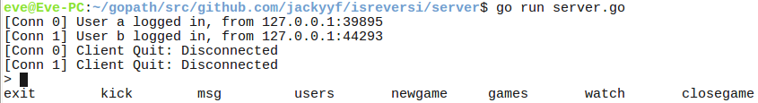
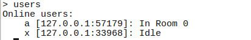
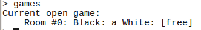
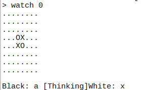
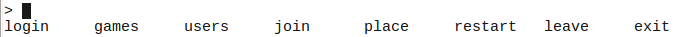
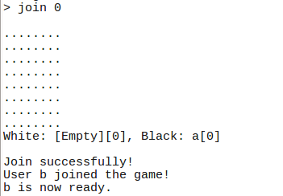
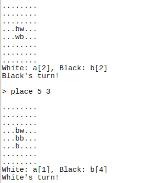

# Isreversi
### 余一夫 13307130355

Isreversi是一个基于命令行的黑白棋游戏，使用golang编写，服务器设计默认支持128位用户同时在线，性能测试上能够支持超过十万个并发连接。

## 1. 网络传输
Isreversi使用的是UDP协议，在UDP上使用了uTP作为可靠连接层。uTP作为一个轻量级的可靠流传输协议，相比于TCP的多篇RFC进行描述和修正，uTP作为BitTorrent的传输协议只有一篇BitTorrent官方的协议规范[BEP0029](http://www.bittorrent.org/beps/bep_0029.html)，协议简单明了轻便。同时uTP本身也是针对大流量传输做了优化，其防阻塞算法简单有效，同时其防阻塞算法也是TCP友好的，不会存在uTP抢占TCP带宽的情况。  
协议的实现借鉴了一个第三方的utp包: github.com/anacrolix/utp。在修改后的uTP实现，只有1200行golang代码，实现了一个golang的网络流传输结构net.Conn。  

## 2. 安全层
Isreversi的协议的每次传输为一个帧，在每次连接建立时，都会进行一次Challenge-Response的公钥交换，其中有32字节随机生成的Payload以保证对方的确为我们所连接的服务器。之后的每个传输帧，都会使用事先协商好的密钥签名，以保证通讯内容不会被篡改。  
这次的安全签名算法使用的是ed25519，ed25519相比于其他的签名算法，有公钥私钥签名长度都十分短，并且签名速度相比于RSA和ECDSA等相比能够有更高的计算速度，能减轻服务器端的计算压力。

## 3. 传输协议

### 3.1 帧结构

| Payload length | Frame type | Packet payload | ed25519 signature |
|:--------------:|:----------:|:--------------:|:-----------------:|
|   2 bytes      |  2 bytes   | <= 65535 bytes |      64 bytes     |

Payload长度域记录的长度不包含Frame type域和ed25519签名域的长度，因而一个帧的长度最大可以为65535 + 68 = 65603字节
ed25519签名域包含前面的所有域: 长度、帧类型和帧内容。

### 3.2 类型定义

#### 3.2.1 整形
* 所有的整形都使用大端法(Big Endian)编码
* `int8`, `uint8`的长度是1字节
* `int16`, `uint16`的长度是2字节
* `int32`, `uint32`的长度是4字节
* `int64`, `uint64`的长度是8字节
* `int`, `uint`是变长的数字编码，使用了Protobuf的VarInt编码，具体编码方式可参阅[Protobuf文档](https://developers.google.com/protocol-buffers/docs/encoding#varints). 同时对于变长有符号数，使用的是ZigZag算法，具体可参阅[ProtoBuf章节](https://developers.google.com/protocol-buffers/docs/encoding#types)。

#### 3.2.2 浮点数
只允许使用IEEE754规范中指明的32位与64位浮点数，使用`float32`和`float64`表示

#### 3.2.3 字符串(string)
字符串为一个变长的数据结构，其前两字节为一个`uint16`类型，表示字符串的字节长度，之后的长度字节为字符串的内容。   
所有字符串**必须**是合法UTF-8编码的字符。

#### 3.2.4 二进制流(bytes)
二进制流与字符串类似，唯一的区别是其内容可以为任意二进制流，而不必是一个合法的UTF-8字符串。
对于协议中写明的定长二进制流，则前面不包含长度的`uint16`类型。

#### 3.2.5 元组(tuple)
元组的表示方法为按照元组内部各类型依次表示即可。

## 4 帧类型

### 4.1 Client Hello
| Frame type | Direction | Client pubkey | Client challenge |
|:----------:|:---------:|:-------------:|:----------------:|
|     0      |  C --> S  |    32 bytes   |     32 bytes     |

这个帧只能在客户端刚连接上服务器后用于握手，其内容包含客户端的公钥和32字节随机Challenge二进制流。  

### 4.2 Server Hello
| Frame type | Direction | Server pubkey | Client challenge | Server challenge |
|:----------:|:---------:|:-------------:|:----------------:|:----------------:|
|     1      |  C <-- S  |    32 bytes   |     32 bytes     |     32 bytes     |
这个帧只能用于响应客户端的Client Hello请求，其中包含服务器的32字节公钥，客户端发来的32字节随机Challenge二进制流，和额外的服务器端生成的32字节随机二进制流。由于所有包都需要使用公钥签名，故带上随机生成的32字节Client Challenge即可保证服务器端拥有起声称的公钥的私钥。

### 4.3 Client Confirm
| Frame type | Direction | Server challenge |
|:----------:|:---------:|:----------------:|
|     2      |  C --> S  |     32 bytes     |
这个帧只能用于响应服务器的Server Hello请求，其中包含服务器端发来的32字节Challenge二进制流，配合该帧合法的签名即可验证客户端的身份。

### 4.4 Server Confirm
| Frame type | Direction |
|:----------:|:---------:|
|     3      |  C <-- S  |
这个帧只能用于响应客户端的Client Confirm请求。在客户端收到该帧以后，双向的链接即正式建立。

### 4.5 Login
| Frame type | Direction | Username |
|:----------:|:---------:|:--------:|
|     4      |  C --> S  |  string  |

| Frame type | Direction | Result |
|:----------:|:---------:|:------:|
|     4      |  C <-- S  |  uint8 |

这个帧用于在连接完成后登录服务器使用。  
其中客户端向服务器端发送的帧包含一个string类型，为客户端希望使用的用户名。   
服务器的响应包含一个uint8类型，若其为0，则表示登录成功，若非0则表示登录失败，客户端应当使用不同的用户名，继续使用帧类型4重新尝试登录直到成功或服务器因为尝试太多而断开连接。

### 4.6 Quit / Kick
| Frame type | Direction | Reason |
|:----------:|:---------:|:------:|
|     5      |  C <-> S  | string |

这个帧是用于正常终止连接使用的，在服务器端主动踢出用户时，或者客户端主动退出时使用。其包含一个string类型，内容为退出或被踢出的原因。

### 4.7 Room List
| Frame type | Direction |
|:----------:|:---------:|
|     6      |  C --> S  |

| Frame type | Direction |   Data   |
|:----------:|:---------:|:--------:|
|     6      |  C <-- S  |   tuple  |

这个帧是用于处理房间列表信息的。客户端发送一个没有任何内容的，帧类型为6的包给服务器端。   
而服务器端应当同样使用类型为6的帧返回，带上一个tuple，其中包含多个tuple，每个tuple为每个房间的房间信息，分别为uint16的房间ID，string的执黑用户，string的执白用户。

### 4.8 Player List
| Frame type | Direction |
|:----------:|:---------:|
|     7      |  C --> S  |

| Frame type | Direction |   Data   |
|:----------:|:---------:|:--------:|
|     7      |  C <-- S  |   tuple  |

这个帧是用于处理玩家列表信息的。客户端发送一个没有任何内容的，帧类型为7的包给服务器端。   
而服务器端应当同样使用类型为7的帧返回，带上一个tuple，其中包含多个string，为每个用户的用户名。

### 4.9 Join Game
| Frame type | Direction | Room ID |
|:----------:|:---------:|:-------:|
|     8      |  C --> S  | uint16  |

| Frame type | Direction | Result |
|:----------:|:---------:|:------:|
|     8      |  C <-- S  | uint8  |

这个帧用于加入某个游戏房间，客户端发送给服务器端的帧中，包含一个uint16类型，为其房间号。  
服务器应当同样使用帧类型8返回，包含一个uint8的结果信息:
* 0: 加入成功
* 1: 加入失败，房间不存在
* 2: 加入失败，房间已满
* 3: 加入失败，你正在另一个游戏中
* 4 ~ 255: 保留类型

### 4.10 Leave Game
| Frame type | Direction |
|:----------:|:---------:|
|     9      |  C <-> S  |

这个帧用于离开游戏房间，由于本帧不需要状态信息，发送本包后用户一定处于游戏大厅，故服务器端只需要响应同样的帧确认即可。

### 4.11 Game restart
| Frame type | Direction |
|:----------:|:---------:|
|     10     |  C --> S  |

这个帧用于向服务器发送准备/重开请求。这个请求并没有任何返回，服务器对其进行处理即可。   

### 4.12 Place
| Frame type | Direction | Position |
|:----------:|:---------:|:--------:|
|     11     |  C --> S  |   uint8  |

这个帧用于向棋盘上放一个棋子，对于position，高4位为x，低4位为y   
服务器对这个请求的响应应当通过Room Update，或者Message进行，更新棋盘或者通知对方发生错误。

### 4.13 Room Update
| Frame type | Direction |  Placed  |  Color  |  Turn  |  White  |  Black  |
|:----------:|:---------:|:--------:|:-------:|:------:|:-------:|:-------:|
|     12     |  C <-- S  |  uint64  |  uint64 |  uint8 |  string |  string |

这个帧用于传向客户端，告诉客户端更新其棋盘状态。  
Placed为一个64bit的BitSet，用于表示每个位置是否有棋子  
Color为对于每个Placed标记的位置，0表示其为黑色，1为白色  
Turn表示当前游戏的状态，0表示游戏结束/未开始，1表示执黑方下子，2表示执白方下子  
White和Black分别为房间内执黑和执白用户的用户名

### 4.14 Chat Message
| Frame type | Direction | Player | Message |
|:----------:|:---------:|:------:|:-------:|
|     13     |  C <-> S  | string |  string |

这个包用于服务器和客户端发送聊天信息，Player为发送方/接收方用户名，而Message为内容。  
对于服务器发送的包，Player为空表示为系统公告，不为空则为其他用户的私信。

## 5 服务器端

### 5.1 服务器端设置
服务器默认监听在UDP 5428端口上，最大允许65536个游戏房间(由于Room ID限制)，无限制用户个数。

### 5.2 服务器功能
服务器端的终端使用了readline，用tab可以弹出补全菜单，会列出当前可用的所有命令:  

#### 5.2.1 Exit命令
Exit命令用于退出服务器端，在退出前，他会踢出所有的用户，告诉用户服务器已经关闭。

#### 5.2.2 Kick命令
Kick命令用于踢出某个用户，允许带上原因告诉客户端其被踢出的原因。

#### 5.2.3 Msg命令
Msg命令用于广播或者给特定用户发送消息。

#### 5.2.4 Users命令
Users用于列出所有连接的用户列表

#### 5.2.5 Newgame命令
Newgame用于新开一个游戏房间

#### 5.2.6 Games命令
Games命令用于列出所有的游戏列表及其参与用户

#### 5.2.7 Watch命令
Watch命令用于观察某个房间的状态

#### 5.2.8 Closegame命令
Closegame命令用于将某个游戏房间关闭，并踢出其中所有游戏用户。

## 6 客户端

### 6.1 客户端设置
客户端会在启动时连接本地的UDP 5428端口，连接失败会自动退出

### 6.2 客户端功能
客户端同样使用了readline，使用tab弹出当前所有可用命令:

#### 6.2.1 Login命令
Login命令用于登录到服务器，对于不合法的用户名，服务器会拒绝登录并弹出提示

#### 6.2.2 Games命令
功能同服务器端Games命令

#### 6.2.3 Users命令
功能同服务器端Users命令

#### 6.2.4 Join命令
加入某个房间，在对方加入时会有提示

#### 6.2.5 Place命令
在棋盘上x y下子

#### 6.2.6 Restart命令
申请重新开始棋局，在没有开始时则为准备。准备时对方会收到提示，可参见Join命令图

#### 6.2.7 Leave命令
离开房间，正在进行的游戏自动终止。

#### 6.2.8 Exit命令
关闭程序，并向服务器发送退出请求。

## 7 总结

  本次实验我更多关注于协议本身的实现，包括基于UDP实现一个可靠的流协议uTP，实现一个保护包不被篡改的签名系统，一个科学的简单高效的帧格式设计等等，故本次游戏功能虽完整，然操作比较不便。不过在本次实验中，从网络层到传输层到应用层，整体的设计让我体会到了设计的难度，同时也领会了设计的趣味。

## 8 代码
本源代码位于github.com/jackyyf/isreversi，所有包均位于该repo的相对路径。

* utp包为一个utp协议的实现
* proto包为帧的底层结构实现
* common包为游戏和用户类型及其操作的类型定义
* server包包含服务器端的main包
* client包包含客户端的main包
